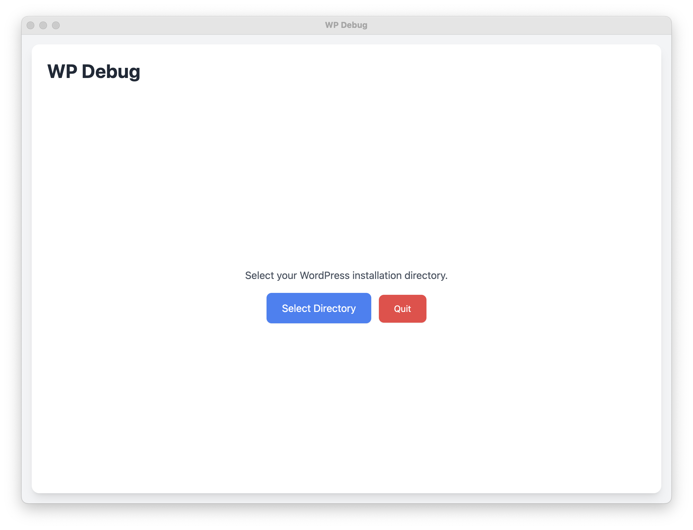
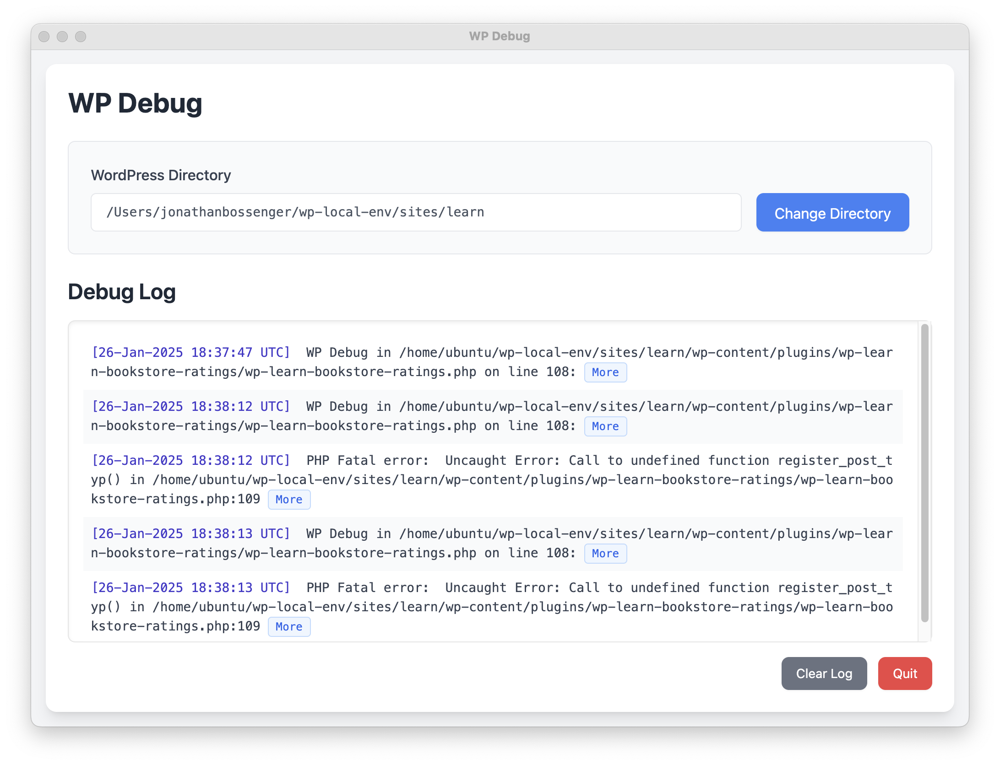
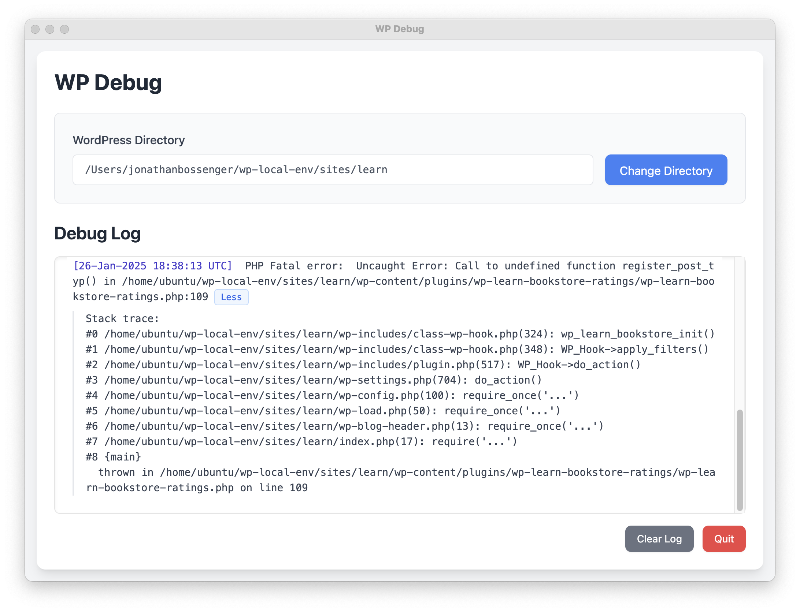
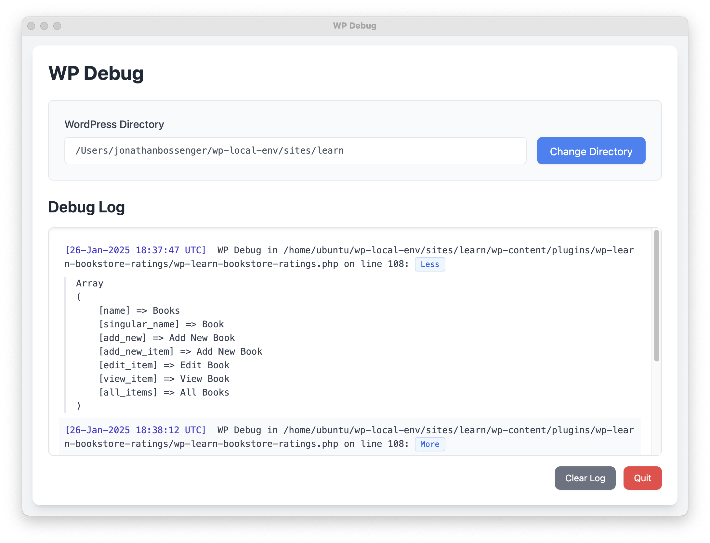

# WP Debug


A desktop application for monitoring WordPress debug logs in real-time. Built with Electron and React.

## Table of Contents
- [Download](#download)
- [Screenshots](#screenshots)
- [Features](#features)
- [Limitations](#limitations)
- [Reporting Bugs/Feature Requests](#reporting-bugsfeature-requests)
- [Technical Stack](#technical-stack)
- [Prerequisites](#prerequisites)
- [Development Setup](#development-setup)
- [Building Executables](#building-executables)
  - [Platform-specific builds](#platform-specific-builds)
- [Usage](#usage)
  - [Using the Debug Helper](#using-the-debug-helper)
- [Development Scripts](#development-scripts)
- [License](#license)

## Download

You can download the latest version of WP Debug from the [GitHub releases page](https://github.com/jonathanbossenger/wp-debug/releases).

Currently available for:
- macOS (Apple Silicon/M1/M2)
- Linux via deb and rpm packages
- Windows

macOS instructions:
1. Extract the zip file
2. Move WP Debug.app to your Applications folder
3. Launch the app

## Screenshots









## Usage

1. Launch the application
2. Select your WordPress installation directory
3. The app will automatically:
   - Validate the WordPress installation
   - Configure debug settings in wp-config.php
   - Create a mu-plugin with the `wp_debug()` helper function
   - Start monitoring the debug.log file
4. New debug log entries will appear in real-time with:
   - Timestamp highlighting
   - Alternating row colors
   - Auto-scroll to latest entries
5. System tray features:
   - Click the bug icon to show/hide the main window
   - Notifications show the first line of new debug entries
   - Click notifications to focus the main window
6. When quitting:
   - Original WordPress debug settings are restored
   - The mu-plugin is cleaned up automatically

### Using the Debug Helper

In your WordPress code, you can use the `wp_debug()` function to log variables:

```php
wp_debug($your_variable);
```

This will log the variable along with the file and line number where it was called.

## Features

- Real-time monitoring of WordPress debug.log files
  - Auto-scrolling to latest entries
  - Timestamp highlighting
  - Alternating row colors for better readability
  - Clear log file contents with one click
- WordPress Integration
  - Automatic detection and validation of WordPress installations
  - Automatic configuration of WordPress debug settings
  - Custom mu-plugin installation for enhanced debugging (`wp_debug()` function)
  - Automatic backup and restoration of original debug settings
- System Tray Integration
  - Minimizes to system tray when closed
  - Real-time notifications for new debug entries
  - First line preview in notifications
  - Custom bug icon for better visibility
  - Click notifications to open main window
- Clean, modern UI with real-time updates
- Cross-platform support (macOS, Windows, Linux)

## Limitations

- Does not work with WordPress installations that are not stored on the local computer (i.e. Docker based installations)

## Reporting Bugs/Feature Requests

Please use the [GitHub issues](https://github.com/jonathanbossenger/wp-debug/issues) page to report bugs or request features.

## Technical Stack

- Electron - Desktop application framework
- React - UI framework
- Tailwind CSS - Styling and responsive design
- Chokidar - File system monitoring
- Sharp - Image processing for system tray icons

## Prerequisites

- Node.js 18.x or higher
- npm 9.x or higher
- A local WordPress installation for testing

## Development Setup

1. Clone the repository:
```bash
git clone https://github.com/yourusername/wp-debug.git
cd wp-debug
```

2. Install dependencies:
```bash
npm install
```

3. Start the development server:
```bash
npm run dev
```

This will:
- Start webpack in watch mode for the renderer process
- Launch Electron in development mode
- Enable hot reloading for React components

## Building Executables

The project uses Electron Forge for building platform-specific executables.

### Build for all platforms:
```bash
npm run make
```

This will create executables in the `out/make` directory for:
- macOS (.dmg)
- Windows (.exe)
- Linux (.deb, .rpm)

### Platform-specific builds:

For macOS:
```bash
npm run make -- --platform=darwin
```

For Windows:
```bash
npm run make -- --platform=win32
```

For Linux:
```bash
npm run make -- --platform=linux
```

## Development Scripts

- `npm start` - Start the application
- `npm run dev` - Start the application in development mode
- `npm run build` - Build the renderer process
- `npm run package` - Package the application without creating installers
- `npm run make` - Create platform-specific distributables

## License

GPL-2.0-or-later 
